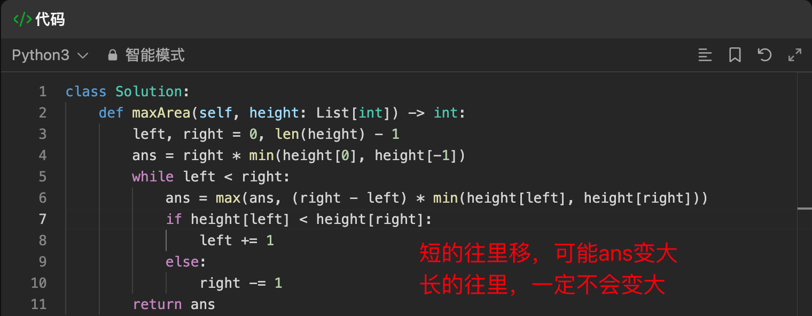
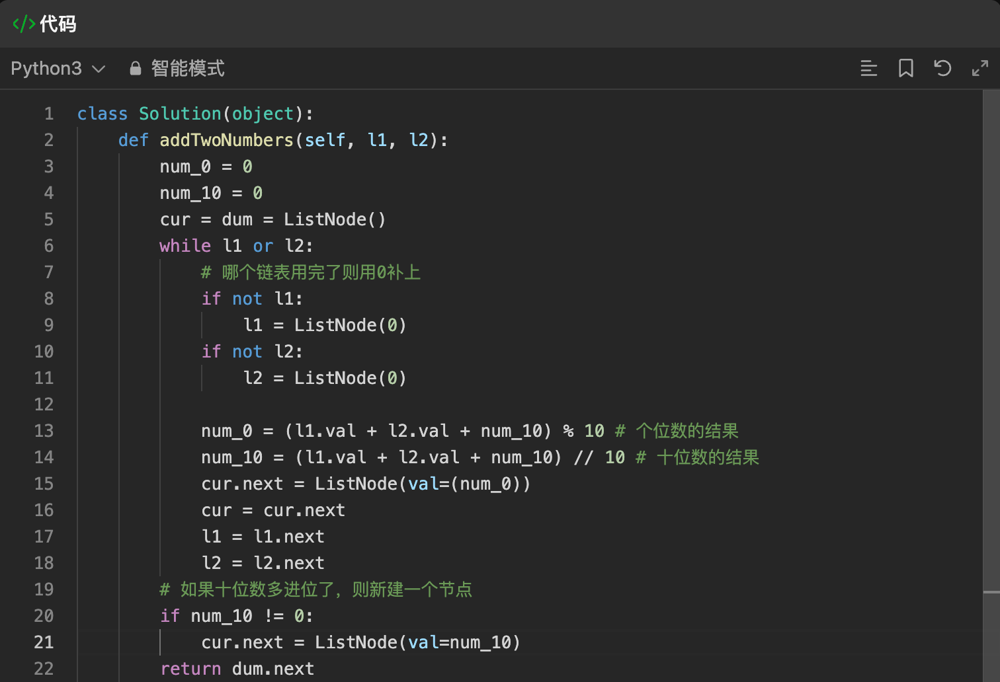
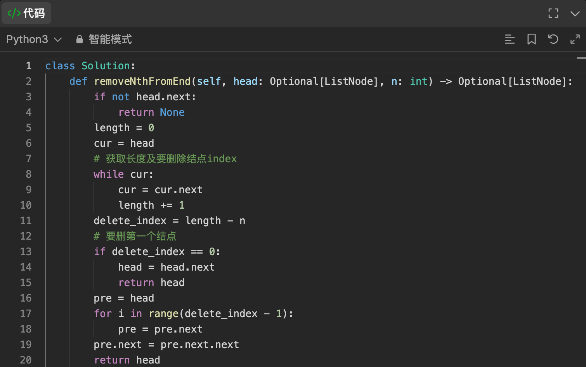
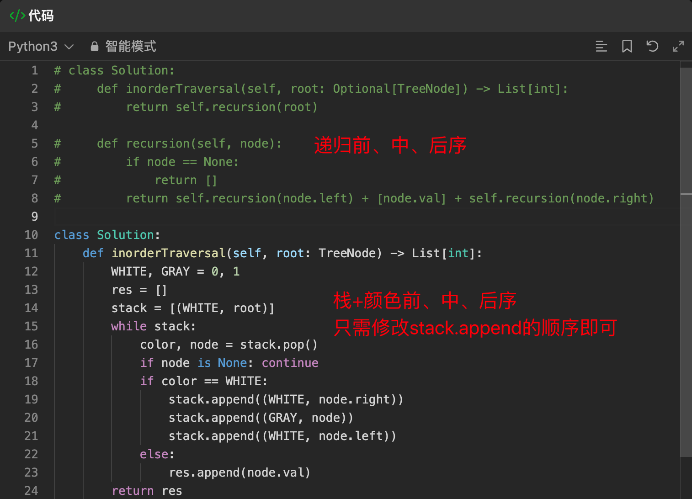
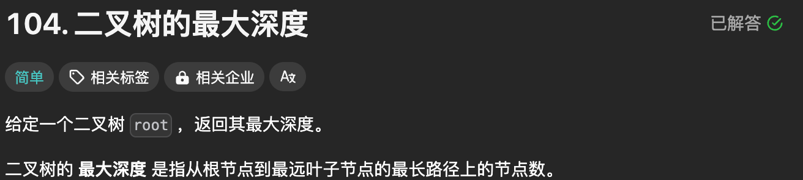
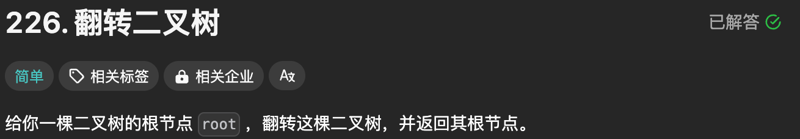
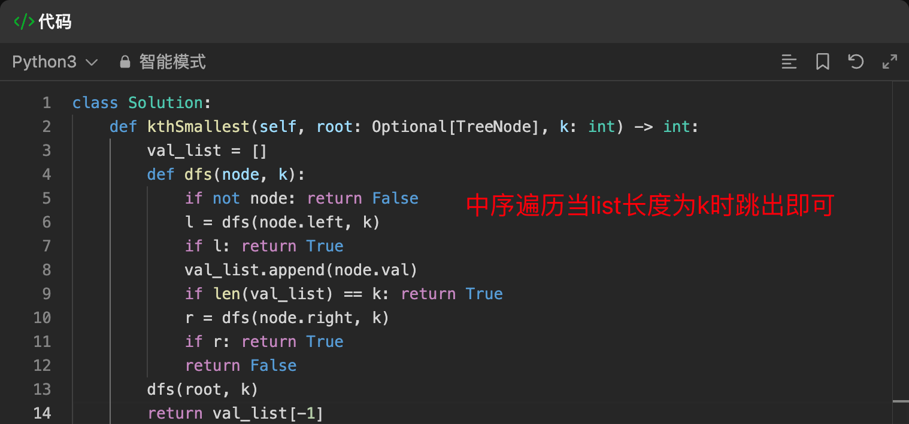

# LeetCode 热题 100

### 一、哈希表

##### 1. 两数之和（1）

##### 2. 字母异位词（49）

##### 3. 最长连续序列（128）

### 二、双指针

##### 4. 移动零（283）

##### 5. 盛水最多的容器（11）

##### 6. 三数之和（15）

##### 7. 接雨水（42）

### 三、滑动窗口

##### 8. 无重复字符的最长子串（3）

##### 9. 找到字符串中所有字母异位词（438）

### 四、子串

##### 10. 和为K的子数组（560）

##### 11.  滑动窗口最大值（239）

##### 12. 最小覆盖子串（76）

### 五、普通数组

##### 13. 最大子数组和（53）

##### 14. 合并区间（56）

##### 15. 轮转数组（189）

##### 16. 除自身以外数组的乘积

##### 17. 缺失的第一个正数（41）

### 六、矩阵

##### 18. 矩阵置零（73）

##### 19. 螺旋矩阵（54）

##### 20. 旋转图像（48）

##### 21. 搜索二维矩阵Ⅱ（240）

### 七、链表

##### 22. 相交链表（160）

##### 23. 反转链表（206）

##### 24. 回文链表（234）

##### 25. 环形链表（141）

##### 26. 环形链表Ⅱ（142）

##### 27. 合并两个有序链表（21）

##### 28. 两数相加（2）

##### 29. 删除链表的倒数第N个结点（19）

##### 30. 两两交换链表中的节点（24）

##### 31. K个一组翻转链表（25）

##### 32. 随机链表的复制（138）

##### 33. 排序链表（148）

##### 34. 合并K个升序链表（23）

##### 35. LRU缓存

### 八、二叉树

##### 36. 二叉树的中序遍历（94）

##### 37. 二叉树的最大深度（104）

##### 38. 翻转二叉树（226）

##### 39. 对称二叉树（101）

##### 40. 二叉树的直径（543）

##### 41. 二叉树的层序遍历（102）

##### 42. 将有序数组转化为二叉搜索树（108）

##### 43. 验证二叉搜索树（98）

##### 44. 二叉搜索树中的第K小的元素

##### 45. 二叉树的右视图（199）

##### 46. 二叉树展开为链表（114）

##### 47. 从前序与中序遍历序列构造二叉树（105）

##### 48. 路径总和Ⅲ（437）

##### 49. 二叉树的最近公共祖先（236）

第一种思路自己想的，第二种思路答案（pq只有三种情况，一pq分布在root左右返回root，二p=root，q在p的左右子树，三q=root，p在q的左右子树，代码需要理解一下）

##### 50. 二叉树中的最大路径和（124）

### 九、图论

##### 51. 岛屿数量（200）

##### 52. 