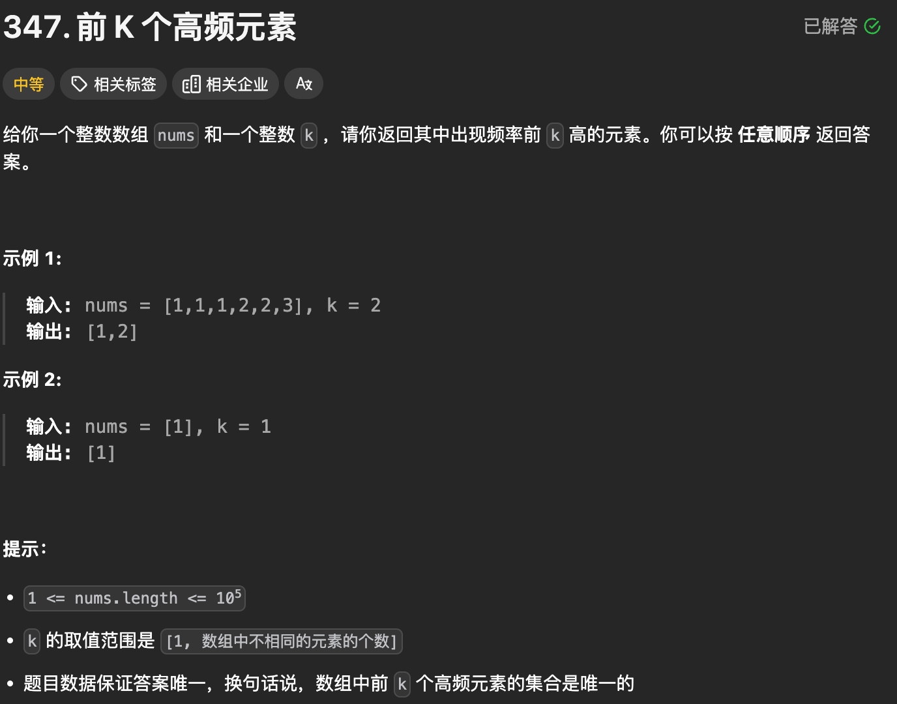

# 腾讯

### 1. 前K个高频元素（347）



```python
# 哈希+字典排序
class Solution:
    def topKFrequent(self, nums: List[int], k: int) -> List[int]:
        dic = {}
        for i in range(len(nums)):
            if nums[i] not in dic:
                dic[nums[i]] = 1
            else:
                dic[nums[i]] += 1
        new_dic = dict(sorted(dic.items(), key=lambda item: item[1], reverse=True))
        ans = []
        i = 0
        for key in new_dic:
            if i < k: ans.append(key)
            else: break
            i += 1
        return ans

# 哈希+堆排序
import heapq as hp
from collections import defaultdict
class Solution:
    def topKFrequent(self, nums: List[int], k: int) -> List[int]:
        dic = defaultdict(int)
        for each in nums:
            dic[each] += 1
        heap = []
        # 默认小顶堆, 放入负值即大顶堆
        for key in dic:
            hp.heappush(heap, [-dic[key], key])
        ans = []
        for i in range(k):
            ans.append(hp.heappop(heap)[1])
        return ans
```

