# 序言——排序总结


| **排序算法** | **时间复杂度（平均）** | **时间复杂度（最差）** | **时间复杂度（最好）** | **空间复杂度** | **排序方式** | **稳定性** | 原理                                                         |
| ------------ | ---------------------- | ---------------------- | ---------------------- | -------------- | ------------ | ---------- | ------------------------------------------------------------ |
| 冒泡排序     | O(n^2)                 | O(n^2)                 | O(n)                   | O(1)           | 内部排序     | 稳定       | 从前往后两两比较，每次冒泡一个最大的到最后                   |
| 选择排序     | O(n^2)                 | O(n^2)                 | O(n^2)                 | O(1)           | 内部排序     | **不稳定** | 每次从未排序中找到最大/最小的放在未排序数组头部              |
| 插入排序     | O(n^2)                 | O(n^2)                 | O(n)                   | O(1)           | 内部排序     | 稳定       | 每遇到一个新位置，将新位置插入到之前已排序序列中，有的元素集体往后移（打扑克） |
| 希尔排序     | O(nlogn)               | O(n^2)                 | O(nlogn)               | O(1)           | 内部排序     | **不稳定** | 插入排序的一种，每次隔`{n/2, n/4, ...}`执行插入排序，最后所有元素一起插入排序 |
| 归并排序     | O(nlogn)               | O(nlogn)               | O(nlogn)               | O(n)           | 外部排序     | 稳定       | 递归，数组分成两半归并，拿到两个数组合并时，分布从前往后遍历小的加入新数组即可 |
| 快速排序     | O(nlogn)               | O(n^2)                 | O(nlogn)               | O(logn)        | 内部排序     | **不稳定** | 递归，选low当pivot，low+1～high搜索，最终把pivot放到左边都小于它右边都大于它的位置 |
| 堆排序       | O(nlogn)               | O(nlogn)               | O(nlogn)               | O(1)           | 内部排序     | **不稳定** |                         |
| 计数排序     | O(n+k)                 | O(n+k)                 | O(n+k)                 | O(k)           | 外部排序     | 稳定       | 找出数组min、max，然后min～max每个整数位置计数，遍历完原数组后遍历min～max，每个位置重复计数次 |
| 桶排序       | O(n+k)                 | O(n^2)                 | O(n+k)                 | O(n+k)         | 外部排序     | 稳定       |                     |
| 基数排序     | O(n×k)                 | O(n×k)                 | O(n×k)                 | O(n+k)         | 外部排序     | 稳定       |                       |

- **n**：数据规模，表示待排序的数据量大小。
- **k**：“桶” 的个数，在某些特定的排序算法中（如基数排序、桶排序等），表示分割成的独立的排序区间或类别的数量。
- **内部排序**：所有排序操作都在内存中完成，不需要额外的磁盘或其他存储设备的辅助。这适用于数据量小到足以完全加载到内存中的情况。
- **外部排序**：当数据量过大，不可能全部加载到内存中时使用。外部排序通常涉及到数据的分区处理，部分数据被暂时存储在外部磁盘等存储设备上。
- **稳定**：如果 A 原本在 B 前面，而 A=B，排序之后 A 仍然在 B 的前面。
- **不稳定**：如果 A 原本在 B 的前面，而 A=B，排序之后 A 可能会出现在 B 的后面。
- **时间复杂度**：定性描述一个算法执行所耗费的时间。
- **空间复杂度**：定性描述一个算法执行所需内存的大小。

### 

------

# 一、tips

### C++

```c++
// 1.容器——vector
#include<vector>
vector<int> a(10) | vector<string> b | vector c(5, 1)  // 初始化，a共10个内存空间，c是5个1
vector<int> (3, 1) | vector<int> {1, 2, 3}             // 其他初始化方式
vector<int>(a.begin(), a.end())                        // 用a赋值，a可以是vector<int>，也可以是unordered_set<int>
.push_back(5) | .pop_back()                            // 尾部添加或删除元素
.size() | .resize(10)                                  // 返回vector大小，重新定义大小
.back() | .front()                                     // 返回vector首部或尾部元素的引用
.begin() | .end()                                      // 返回vector<int>::iterator，用于遍历
.insert(a.begin(), 5) | .insert(a.begin()+1, 3, 5)     // 位置0插入5，位置1插入3个5，返回插入位置的迭代器
.erase(a.begin()) | .erase(a.begin()+1, a.begin()+3)   // 删除a的0位置元素，删除a的1～3位置元素，返回删除位置的迭代器
```

```c++
// 2.哈希集——unordered_set
#include<unordered_set>
unordered_set<int> hash_set                            // 初始化
.insert(5) | .erase(4)                                 // 插入、删除
.count(5) | .size()                                    // 对某元素计数、返回哈希集大小
.begin() | .end()                                      // 返回iterator，用于遍历
.clear() | .empty()                                    // 清空、判断是否为空
```

```c++
// 3.哈希映射——unordered_map
#include<unordered_map>
unordered_map<int, int> hash_map | hash_map[1] = 2     // 初始化、为空或不空均可直接赋值，
.insert(make_pair(1, 2)) | .erase(4)                   // 插入（make_pair直接用）删除（4为key）
.count(5) | .size()                                    // 对某元素计数（5为key）、返回哈希集大小
.begin() | .end()                                      // 返回iterator，用于遍历
.clear() | .empty()                                    // 清空、判断是否为空
for (unordered_map<int, int>::iterator it = hash_map.begin(); it != hash_map.end(); it++) {
    cout << *it.first << *it.second << it->first << it->second << endl;
}

// 3.1 映射——map，用法同unordered_map
#include<map>
map<int, int> m | m[1] = 2
m[i].emplace_back(2)
```

```c++
// 4.字符串——string
#include<string>
string s = "abc" | string s(2, 'c') | to_string(123)   // 初始化
.size() | .length()                                    // 返回长度，尽量用size，length返回无符号
.resize()                                              // 调整字符串长度
.substr(5) | .substr(5, 3)                             // 取子串，从5截到尾、从5往后截3个
.push_back('a') | .append('b') ｜ += 'a'               // 末尾追加
.insert(0, "abc") | .insert(1, "abc", 1, 2)            // 0位置插入abc、1位置插入bc
.pop_back() ｜ .erase(0, 1)                            // 末尾删除、删除位置0开始数1个字符
.replace(1, 2, "abc")                                  // 位置1开始数2个字符替换为abc
.begin() | .end()                                      // 返回iterator，用于遍历
string s = "abc"; s[1] = 'm'                           // 可以直接赋值改变

// 字符串转数字
#include<cstdlib>
stoi("123") | stol("123") | stoll("123")               // 转int、long、long long

// 字符串比大小
str1.compare(str2) | strcmp(str1, str2)                // 逐位比大小，按照ascii码
  
// 大小写转换
#include<cctype>
tolower("ABC") | toupper("abc")                        // 大转小、小转大
```

```c++
// 5.栈和队列——stack、queue
#include<stack> | #include<queue>
.size()                                                // 求大小均是size
.push() | .pop() | .empty() | .top()                   // 栈
.push() | .pop() | .empty() | .front() | .back()       // 队列

// 优先队列
#include<priority_queue>
priority_queue<int> | priority_queue<int, less<int>()> // 队头大、队头小
```

```c++
// 6.各类算法函数——algorithm
#include<algorithm>
sort(起始地址, 结束地址, 排序规则) | less或great<类型>()    // 不设置规则默认小到大，即less
sort(~, ~, cmp) | static bool cmp(a, b) {return a > b} // 自定义规则，此处是降序，必须加static
reserve(起始地址, 结束地址)                               // 转换顺序
copy(a起始地址, a结束地址, b起始地址)                      // a复制到b
find(起始地址, 结束地址, 10)                              // 找到10返回指针，找不到返回.end()
count(起始地址, 结束地址, 查找字符)                        // 返回字符串中查找字符的数量
```

```c++
// 7.输入输出——printf、scanf
printf("%s%d", str, num)                               // 输出字符串和数字，不需要地址
scanf("%s%d", str, &num)                               // 输入字符串和数字，需要地址，str本身地址
%s、%c、%d、%f、%lf                                     // string、char、int、float、double
%04d、%.4f                                             // 不足4位补0、保留4位小数
```

```c++
// 8.常用函数

// 8.1 accumulate
#include<numeric>
accumulate(起始地址, 结束地址, 累加初值)
  
// 8.2 memset
#include<string.h>
dp[m][n] ——————> memset(dp, -1或0或false, m*n或sizeof(dp))  // 填1会出问题，一般填0、-1、false
  
// 8.3 is系列
isalpha() | isupper() | isdigit() | islower()          // 是否字母、大写、数字、小写，返回0或1
```

### python

```python
"""
1. 列表
"""

# 求二维数组dp的最大值
max(map(max, dp))

# 按照子列表的第n个元素排序，默认升序倒序用-x[n]
list_demo.sort(key=lambda x: x[2])

# 列表插入删除(末尾添加、指定位置添加、删除指定位置元素并返回删除元素、删除指定值元素)
list_demo.append(1)
list_demo.insert(0, 1)
del_element = list_demo.pop(0)
list_demo.remove(1)
```

```python
"""
2. 堆
"""

import heapq as hq

# 默认小顶堆(需要大顶堆的话压入时取负, 弹出取负即可), 如果每个元素是一个list/tuple则默认按第一个元素排序
heap = []
for i in range(100, 0, -1):
    hq.heappush(heap, i)

# 插入删除操作, heappop弹出最小元素
hq.heappush(heap, 1)
hq.heappop(heap)

# 令一个list变成最小堆list, 原地修改无返回值
hq.heapify(list_demo)

# 第n最大最小元素
hq.nlargest(1, heap)
hq.nsmallest(3, heap)

# 自定义比较函数, 重写对象的__lt__函数(即<)
class Event:
    def __init__(self, ctime, name) -> None:
        self._ctime = ctime
        self._name = name

    def __lt__(self, other):
        if self._ctime < other._ctime:
            return True
        elif self._ctime == other._ctime:
            if self._eid < other._eid:
                return True
            else:
                return False
        else:
            return False

hq.heappush(pq, Event(100, 'a'))
hq.heappush(pq, Event(20, 'b'))
hq.heappush(pq, Event(100, 'c'))
hq.heappush(pq, Event(20, 'd'))
```

```python
"""
3. 位运算
"""

# 与, 与0与是0, 与自己与是自己
5 & 0 == 0
5 & 5 == 5

# 或, 与0或是自己, 与自己或是自己
5 | 0 == 5
5 | 0 == 5

# 异或, 与0异或是自己, 与自己异或是0
5 ^ 0 == 5
5 ^ 5 == 0

# 非, 所有位置取反。例如，~5（101） = -6，这里的机制是，负数使用补码表示，正数补码就是他本身，而～5对应的32位二进制数是1111 1111 1111 1111 1111 1111 1111 1010，首先判断正负数，最左边1为负0为正，所以这个数是负数，如果是正数直接转化为十进制即可，其次负数转十进制，所有位取反再加一再加符号，取反加一得到0000 0000 0000 0000 0000 0000 0000 0110，加符号得到-6
~5 == -6
~(-6) == 

# 逻辑左移、逻辑右移
5 << 2 == 20
5 >> 1 == 2
-6 << 1 == -12
-5 >> 1 == -3
```


---

# 二、数组

### 2.1 二分查找（704、35、34、69、367）

- ##### 704（二刷2024/08/10）


```python
class Solution:
    def search(self, nums: List[int], target: int) -> int:
        left, right = 0, len(nums) - 1
        while left <= right:
            mid = left + (right - left) // 2
            if nums[mid] == target: return mid
            elif nums[mid] > target: right = mid - 1
            else: left = mid + 1
        return -1
```

- ##### 35（二刷2024/08/10）


```python
class Solution:
    def searchInsert(self, nums: List[int], target: int) -> int:
        left, right = 0, len(nums) - 1
        while left <= right:
            mid = left + (right - left) // 2
            if nums[mid] == target: return mid
            elif nums[mid] > target: right = mid - 1
            else: left = mid + 1
        return left
```

- ##### 34（二刷2024/08/10）


```python
class Solution:
    def searchRange(self, nums: List[int], target: int) -> List[int]:
        left, right = 0, len(nums) - 1
        while left <= right:
            mid = (left + right) // 2
            if nums[mid] == target:
                ans_l, ans_r = mid, mid
                while ans_l > 0 and nums[ans_l-1] == nums[ans_l]: ans_l -= 1
                while ans_r < len(nums) - 1 and nums[ans_r] == nums[ans_r + 1]: ans_r += 1
                return [ans_l, ans_r]
            elif nums[mid] > target: right = mid - 1
            else: left = mid + 1
        return [-1, -1]
```

- ##### 69（二刷2024/08/10）


```python
class Solution:
    def mySqrt(self, x: int) -> int:
        temp = x
        while temp * temp > x:
            temp = temp // 2
        left, right = temp, temp * 2
        while left <= right:
            mid = left + (right - left) // 2
            if mid * mid == x: return mid
            elif mid * mid > x: right = mid - 1
            else: left = mid + 1
        return right
```

- ##### 367（二刷2024/08/10）


```python
class Solution:
    def isPerfectSquare(self, num: int) -> bool:
        temp = num
        while temp * temp > num:
            temp = temp // 2
        left, right = temp, temp * 2
        while left <= right:
            mid = left + (right - left) // 2
            if mid * mid == num: return True
            elif mid * mid > num: right = mid - 1
            else: left = mid + 1
        return False
```

### 2.2 移除元素（27、26、283、844）

- ##### 27（二刷2024/08/10）


```python
class Solution:
    def removeElement(self, nums: List[int], val: int) -> int:
        length = len(nums)
        k = 0
        for i in range(length):
            if nums[i] != val:
                nums[k] = nums[i]
                k += 1
        return k
```

- ##### 26（二刷2024/08/10）


```python
class Solution:
    def removeDuplicates(self, nums: List[int]) -> int:
        length = len(nums)
        k = 1
        for i in range(1, length):
            if nums[i] != nums[i-1]:
                nums[k] = nums[i]
                k += 1
        return k
```

- ##### 283（二刷2024/08/10）


```python
class Solution:
    def moveZeroes(self, nums: List[int]) -> None:
        length = len(nums)
        k = 0
        for i in range(length):
            if nums[i] != 0:
                nums[k] = nums[i]
                k += 1
        for i in range(k, length):
            nums[i] = 0
```

- ##### 844（二刷2024/08/10）


```python
class Solution:
    def backspaceCompare(self, s: str, t: str) -> bool:
        s_done, t_done = '', ''
        len_s, len_t = len(s), len(t)
        for i in range(len_s):
            if s[i] != '#': s_done += s[i]
            else: s_done = s_done[:-1]
        for i in range(len_t):
            if t[i] != '#': t_done += t[i]
            else: t_done = t_done[:-1]
        return s_done == t_done
```

### 2.3 有序数组的平方（977）

- ##### 977（二刷2024/08/18）


```python
class Solution:
    def sortedSquares(self, nums: List[int]) -> List[int]:
        left, right = 0, len(nums) - 1
        ans, pos = [0] * len(nums), right
        while left <= right:
            if nums[left] * nums[left] >= nums[right] * nums[right]:
                ans[pos] = nums[left] * nums[left]
                left += 1
            else:
                ans[pos] = nums[right] * nums[right]
                right -= 1
            pos -= 1
        return ans
```

### 2.4 长度最小的子数组（209、904、76）

- ##### 209


- ##### 904


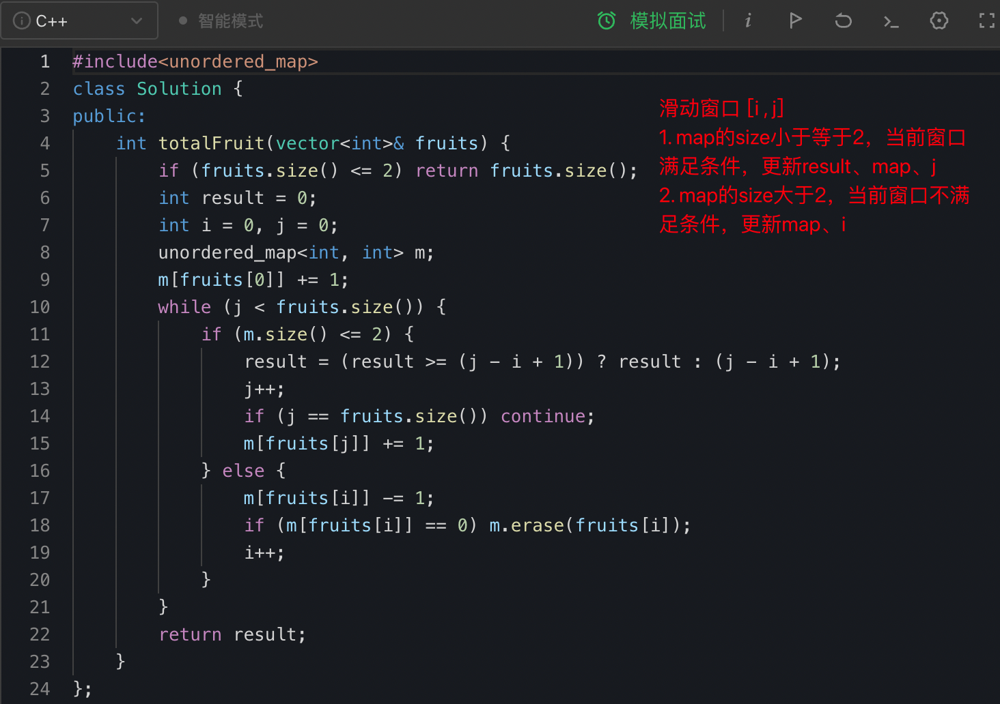

- ##### 76


```c++
#include<unordered_map>
class Solution {
public:
    string minWindow(string s, string t) {
        if (s.size() < t.size()) return "";
        // tm维护s子串中还需要多少个某个字母才能满足条件
        unordered_map<char, int> tm;
        for (int i = 0; i < t.size(); i++) {
            tm[t[i]] += 1;
        }
        // if_cover维护当前子串是否满足条件，解决了每次都需要遍历一遍tm的问题
        int left = 0, right = 0, if_cover = 0, min_length = s.size() + 1;
        vector<int> result = vector<int> (2, -1);
        for (; right < s.size(); right++) {
            // t中不含的字母，跳过
            if (tm.find(s[right]) == tm.end()) {
                continue;
            } else {
                // s子串中的s[right]数量等于t中s[right]数量，=0才++，s[right]第一次满足才++
                if (--tm[s[right]] == 0) if_cover++;
                // s子串已满足题目条件
                if (if_cover == tm.size()) {
                    // 子串第一次满足条件时，更新min_length和result
                    if (min_length > (right - left + 1)) {
                        min_length = (right - left + 1);
                        result[0] = left, result[1] = right;
                    }
                    // 左移left直至s子串不满足题目条件
                    while (if_cover == tm.size()) {
                        // 移除的字符在t中
                        if (tm.find(s[left]) != tm.end()) {
                            // 移除后s子串中的s[left]已不满足题目条件，跳出while循环
                            if(++tm[s[left]] == 1) {
                                if_cover--;
                                left++;
                                continue;
                            }
                            // 移除后s子串中的s[left]仍满足题目条件，left先加，然后更新
                            else {
                                left++;
                                // 更新min_length和result
                                if (min_length > (right - left + 1)) {
                                    min_length = (right - left + 1);
                                    result[0] = left, result[1] = right;
                                }
                            }
                        // 移除的字符不在t中，left先加，然后更新
                        } else {
                            left++;
                            // 更新min_length和result
                            if (min_length > (right - left + 1)) {
                                min_length = (right - left + 1);
                                result[0] = left, result[1] = right;
                            }
                        }
                    }
                }
            }
        }
        if (min_length == (s.size() + 1)) return "";
        return s.substr(result[0], result[1] - result[0] + 1);
    }
};
```

### 2.5 螺旋矩阵2⃣️（59、54）

- ##### 59

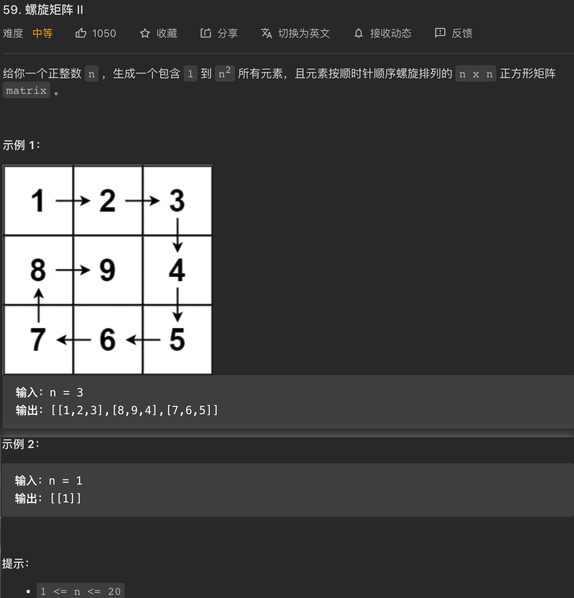


- ##### 54


---

# 三、链表

### 3.1 移除链表元素（203）

- ##### 203


### 3.2 反转链表（206）

- ##### 206


### 3.3 两两交换链表中的节点（24）

- ##### 24


### 3.4 寻找循环链表的入口（LCR 022）

- ##### LCR 022


```python
"""
假设链表有a+b的结点, 前a个结点是头结点～入口结点前, 后b个结点是环的长度(包含入口结点)
fast走的步数f, slow走的步数s, 则 f=2s
fast比slow多走了n个环的距离, 则 f=s+nb（环有b个结点按说距离是b-1, 但因为是环, 所以1个环距离是b）
解得 f=2nb, s=nb
而从头结点到入口结点走的步数是 a+nb
所以相遇位置再走 a 步即可到达入口结点, 而头结点到入口结点的步数也是 a 步, 所以两者同时出发相遇点即是入口结点
"""

class Solution(object):
    def detectCycle(self, head):
        fast, slow = head, head
        while True:
            if not (fast and fast.next): return
            fast, slow = fast.next.next, slow.next
            if fast == slow: break
        fast = head
        while fast != slow:
            fast, slow = fast.next, slow.next
        return fast
```

---

# 四、哈希表

### 4.1 哈希表理论基础

|        集合        | 底层实现 | 是否有序 | 数值是否可以重复 | 能否更改数值 | 查询效率 | 增删效率 |
| :----------------: | :------: | :------: | :--------------: | :----------: | :------: | :------: |
|      std::set      |  红黑树  |   有序   |        否        |      否      | O(log n) | O(log n) |
|   std::multiset    |  红黑树  |   有序   |        是        |      否      | O(logn)  | O(logn)  |
| std::unordered_set |  哈希表  |   无序   |        否        |      否      |   O(1)   |   O(1)   |

|        映射        | 底层实现 | 是否有序 | 数值是否可以重复 | 能否更改数值 | 查询效率 | 增删效率 |
| :----------------: | :------: | :------: | :--------------: | :----------: | :------: | :------: |
|      std::map      |  红黑树  | key有序  |   key不可重复    | key不可修改  | O(logn)  | O(logn)  |
|   std::multimap    |  红黑树  | key有序  |    key可重复     | key不可修改  | O(log n) | O(log n) |
| std::unordered_map |  哈希表  | key无序  |   key不可重复    | key不可修改  |   O(1)   |   O(1)   |

### 4.2 有效的字母异位词（242、383、49、438）

- ##### 242


- ##### 383


- ##### 49


- ##### 438

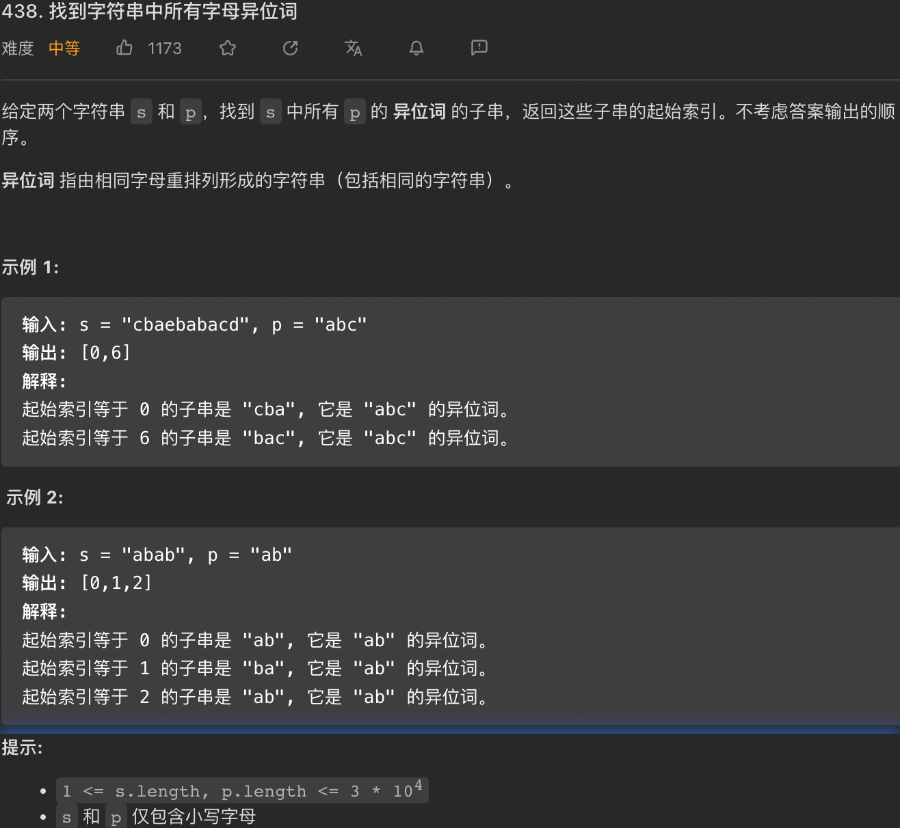


### 4.3 两个数组的交集（349、350）

- ##### 349


- ##### 350


### 4.4 快乐数（202）

- ##### 202


### 4.5 两数之和（1——梦开始的地方）

- ##### 1

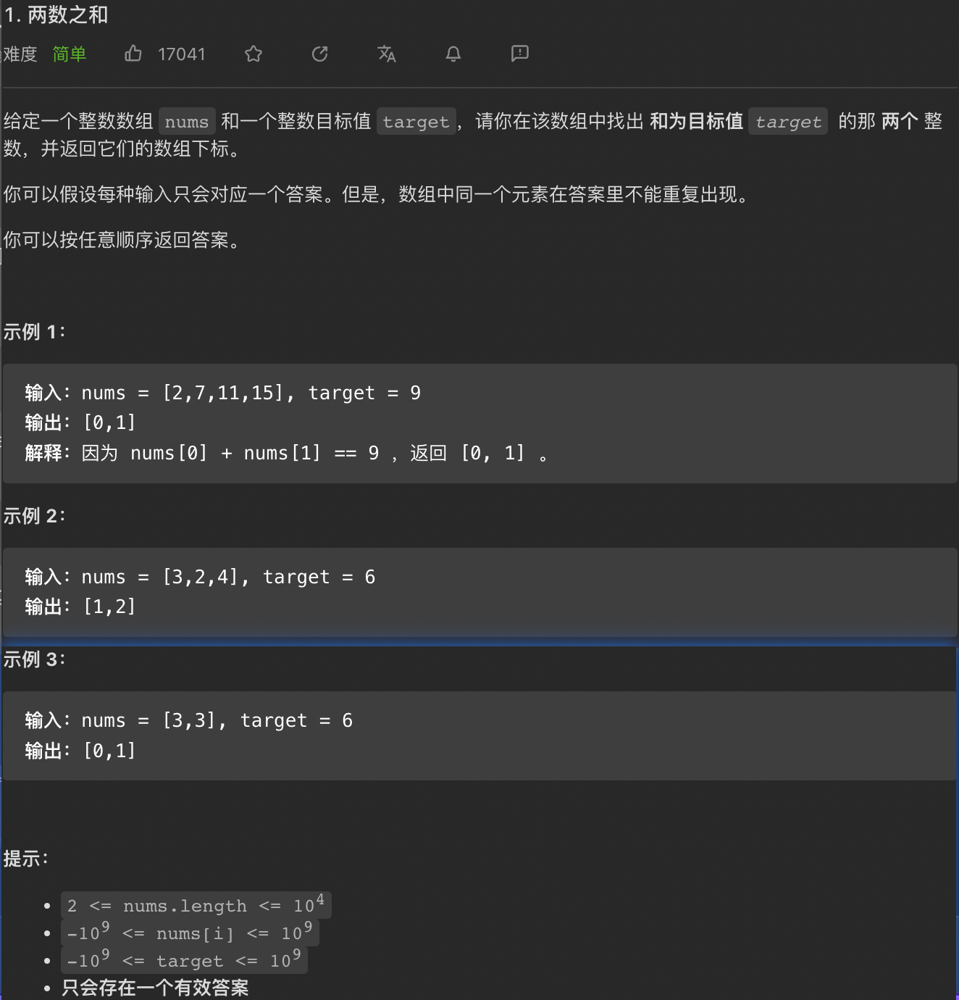


### 4.6 四数之和（454）

- ##### 454


### 4.7 三数之和（15——非哈希表解法，哈希表很难写）

- ##### 15（双指针法）


```c++
class Solution {
public:
    vector<vector<int>> threeSum(vector<int>& nums) {
        vector<vector<int>> answer;
        if(nums.size() < 3) return answer;
        sort(nums.begin(), nums.end());
        vector<int> temp;
        int size = nums.size();
        for(int i=0;i<size;i++){
            if(nums[i] > 0) return answer;
            if(i > 0 && nums[i] == nums[i-1]) continue;  //保证无重复，因为若i和i-1相等，则i-1遍历时就已经把可能的答案装进answer了，也即若i和i-1相等，i-1的所有可能答案包含i的所有可能答案，故跳过，所以直接continue i++
            int left = i+1;
            int right = size-1;
            while(left < right){
                if(nums[i] + nums[left] + nums[right] == 0){
                    temp.push_back(nums[i]);
                    temp.push_back(nums[left]);
                    temp.push_back(nums[right]);
                    answer.push_back(temp);
                    temp.clear();
                    while(left < right && nums[left] == nums[left+1]) left++;
                    while(left < right && nums[right] == nums[right-1]) right--;
                    left++;
                    right--;
                }
                else if(nums[i] + nums[left] + nums[right] > 0) right--;
                else left++;
            }
        }
        return answer;
    }
};
```

- ##### 611（番外篇，求三角形个数）


### 4.8 四数之和（18——非哈希表解法，哈希表很难写）

- ##### 18（双指针法）


```c++
class Solution {
public:
    vector<vector<int>> fourSum(vector<int>& nums, int target) {
        vector<vector<int>> answer;
        if(nums.size() < 4) return answer;
        sort(nums.begin(), nums.end());
        int a, b, c, d;
        int num_size = nums.size();
        for(a = 0; a < num_size-3; a++){
            if(a > 0 && nums[a] == nums[a-1]) continue;
            for(b = a+1; b < num_size-2; b++){
                if(b > a+1 && nums[b] == nums[b-1]) continue;
                c = b+1;
                d = num_size-1;
                while(c < d){
                    if((long) nums[a] + nums[b] + nums[c] + nums[d] == target){
                        answer.push_back(vector<int>{nums[a], nums[b], nums[c], nums[d]});
                        while(c < d && nums[c] == nums[c+1]) c++;
                        while(c < d && nums[d] == nums[d-1]) d--;
                        c++;
                        d--;
                    }
                    else if((long) nums[a] + nums[b] + nums[c] + nums[d] < target){
                        c++;
                    }
                    else{
                        d--;
                    }
                }
            }
        }
        return answer;
    }
};
```

# 五、字符串

### 5.1 反转字符串（344）

- ##### 344


### 5.2 反转字符串2⃣️（541）

- ##### 541


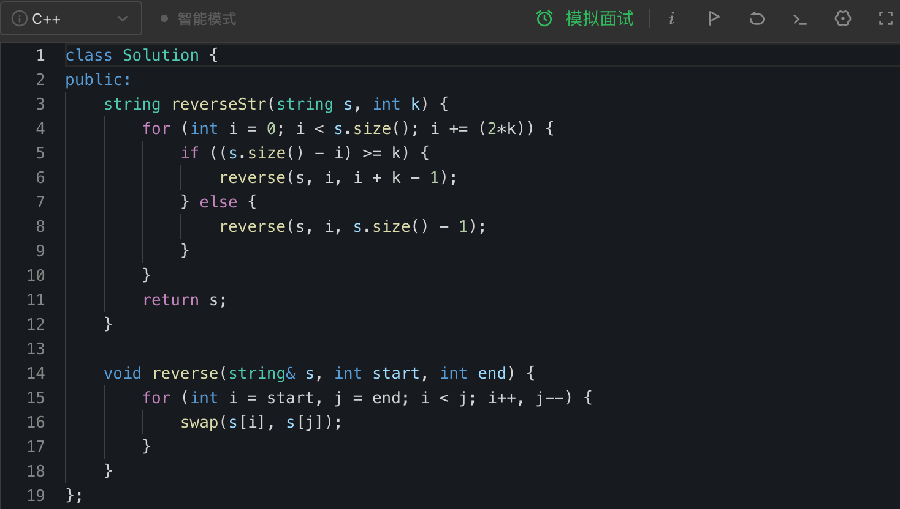

### 5.3 替换空格（剑指offer.05）

- ##### 剑指offer.05


### 5.4 反转字符串中的单词（151）

- ##### 151


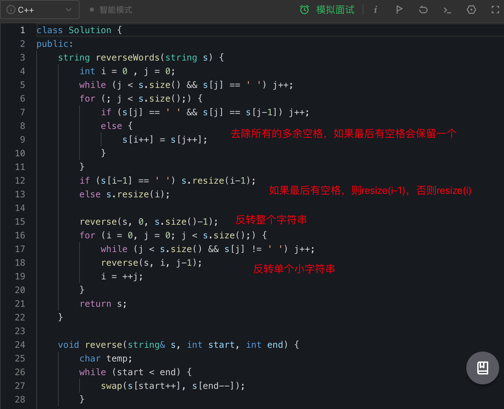

### 5.5 左旋转字符串（剑指Offer58-Ⅱ）

- ##### 剑指Offer58-Ⅱ


### 5.6 找出字符串第一个匹配项的下标（28）

- ##### 28

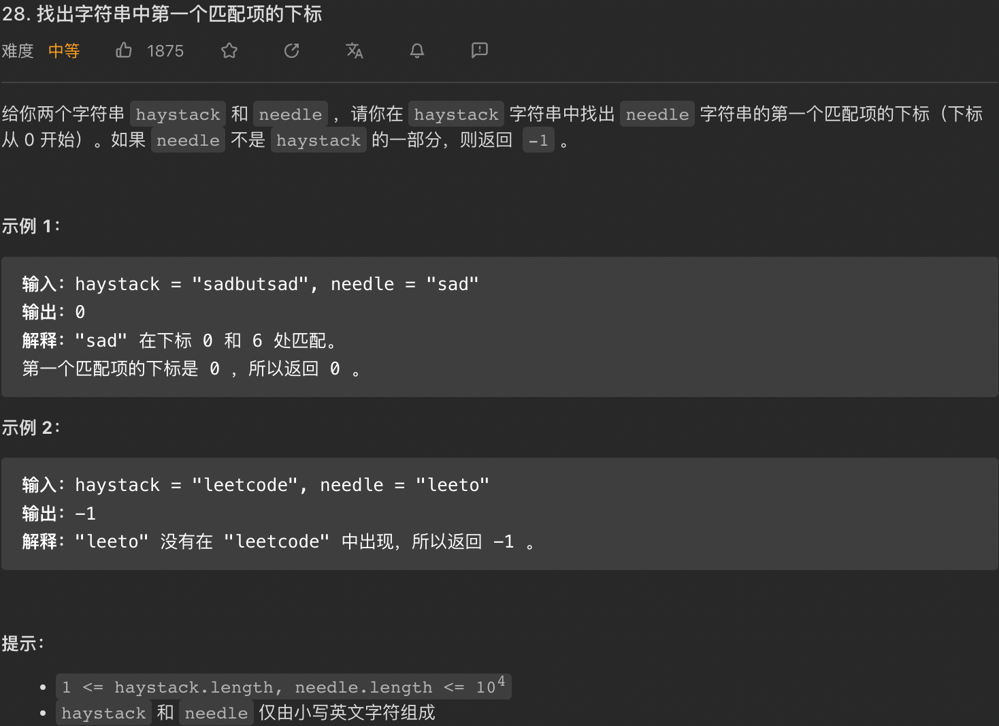


https://www.bilibili.com/video/BV1AY4y157yL/?spm_id_from=333.337.search-card.all.click&vd_source=6f0df852abe327699994b0b1bc03296d

# 6、动态规划（dp）

### 6.1 动态规划基础


### 6.2 斐波那契数（509）

- ##### 509


### 6.3 爬楼梯（70）

- ##### 70


### 6.4 使用最小花费爬楼梯（746）

- ##### 746


### 6.5 不同路径（62、63）

- ##### 62


- ##### 63


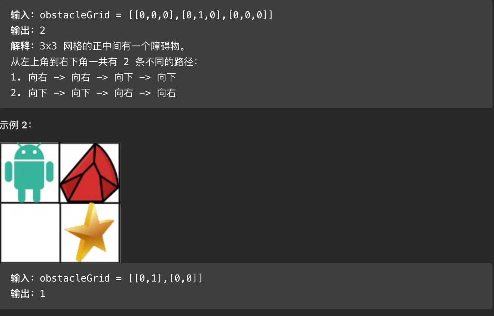


### 6.6 整数拆分（343）

- ##### 343


补充：dp[6]的24拆分，为什么不dp[2]dp[4]，因为dp[2]会拆成11，已经在1dp[5]考虑过了；同理dp[3]dp[3]，前面的dp[3]已经在2dp[4]考虑过了，因为3会拆成12和21，就算拆成111也在1dp[5]考虑过了

### 6.7 0-1背包问题

**0-1背包问题题目描述**：有n件物品和一个最多能背重量为w的背包。第i件物品的重量是weight[i]，得到的价值是value[i] 。每件物品只能用一次，求解将哪些物品装入背包里物品价值总和最大。假设物品信息如下，背包最多可装重量为4的物品。

|       | 重量 | 价值 |
| ----- | ---- | ---- |
| 物品0 | 1    | 15   |
| 物品1 | 3    | 20   |
| 物品2 | 4    | 30   |

##### 二维数据写法：

- dp [i] [j] 含义：表示从下标为 [0-i] 的物品里任意取，放进容量为j的背包，价值总和最大是多少
- 递推公式：dp [i] [j] = max(dp [i - 1] [j], dp [i - 1] [j - weight[i]] + value[i])，即不放物品i和放物品i
- 初始化：dp [i] [0] = 0，因为背包重量为0时放不进东西。dp [0] [j] 当j大于等于物品0的重量时，dp [0] [j] = value [0]，dp [0] [j] 当j小于物品0的重量时，dp [0] [j] = 0。其余位置均初始化为0即可（dp [i] [j] 是由左上方数值推导出来了，那么其他下标初始为什么数值都可以，因为都会被覆盖）
- 遍历顺序：先物品后重量（更好） / 先重量后物品，都是靠左上方数据推出来的，所以先后不影响

```c++
void test_2_wei_bag_problem1() {
    vector<int> weight = {1, 3, 4};
    vector<int> value = {15, 20, 30};
    int bagweight = 4;

    // 二维数组
    vector<vector<int>> dp(weight.size(), vector<int>(bagweight + 1, 0));

    // 初始化
    for (int j = weight[0]; j <= bagweight; j++) {
        dp[0][j] = value[0];
    }

    // weight数组的大小 就是物品个数
    for(int i = 1; i < weight.size(); i++) { // 遍历物品
        for(int j = 0; j <= bagweight; j++) { // 遍历背包容量
            if (j < weight[i]) dp[i][j] = dp[i - 1][j];
            else dp[i][j] = max(dp[i - 1][j], dp[i - 1][j - weight[i]] + value[i]);

        }
    }

    cout << dp[weight.size() - 1][bagweight] << endl;
}

int main() {
    test_2_wei_bag_problem1();
}
```

##### 一维数据写法（滚动数组，自己覆盖自己）：

- dp[j] 含义：容量为j的背包，所背的物品价值可以最大为dp[j]
- 递推公式：dp[j] = max(dp[j], dp[j - weight[i]] + value[i])，即不放物品i和放物品i
- 初始化：全0即可
- 遍历顺序：先物品后重量（重量倒序遍历）❗️❗️


```c++
void test_1_wei_bag_problem() {
    vector<int> weight = {1, 3, 4};
    vector<int> value = {15, 20, 30};
    int bagWeight = 4;

    // 初始化
    vector<int> dp(bagWeight + 1, 0);
    for(int i = 0; i < weight.size(); i++) { // 遍历物品
        for(int j = bagWeight; j >= weight[i]; j--) { // 遍历背包容量
            dp[j] = max(dp[j], dp[j - weight[i]] + value[i]);
        }
    }
    cout << dp[bagWeight] << endl;
}

int main() {
    test_1_wei_bag_problem();
}
```

- ##### 416（01背包是否能装满，装满True）


- ##### 1049（dp含义同上，本题其实就是尽量让石头分成重量相同的两堆，相撞之后剩下的石头最小，**这样就化解成01背包问题了**）


- ##### 494（01背包有多少种方式装满）


假设所有取正数的为left，所有取负数的为right，left+right=sums，left-right=target，所以left=(sums+target)/2

- ##### 474（01背包二维背包容量，最多能装多少个物品）


### 6.8 完全背包问题

**完全背包问题题目描述**：有n件物品和一个最多能背重量为w的背包。第i件物品的重量是weight[i]，得到的价值是value[i] 。每件物品可以用无限次，求解将哪些物品装入背包里物品价值总和最大。**无限次的条件与01背包只差在遍历顺序上**❗️❗️

```python
# 一维dp的内层循环正序遍历，表示一个物品可以拿多次，且顺序可颠倒，原因看代码随想录笔记
for i in range(len(weight)):  # 遍历物品
    for j in range(weight[i], bagWeight + 1):  # 遍历背包容量
        dp[j] = max(dp[j], dp[j - weight[i]] + value[i])
```

- ##### 52（[卡码网KamaCoder](https://kamacoder.com/)）


- ##### 518（组合）


- ##### 377（排列）


- ##### 57（[卡码网KamaCoder](https://kamacoder.com/)）


- ##### 322


- ##### 279


- ##### 139


### 6.9 多重背包问题（基本不会考，只一个例题，解法同01）

- ##### 56（[卡码网KamaCoder](https://kamacoder.com/)）


### 6.10 背包问题总结


>1. 确定dp数组（dp table）以及下标的含义
>2. 确定递推公式
>3. dp数组如何初始化
>4. 确定遍历顺序
>5. 举例推导dp数组

- ##### 递推公式

| 类型                               | 递推公式                                           |
| ---------------------------------- | -------------------------------------------------- |
| 问能否能装满背包（或者最多装多少） | `dp[j] = max(dp[j], dp[j - nums[i]] + nums[i])`    |
| 问装满背包有几种方法               | `dp[j] += dp[j - nums[i]]`                         |
| 问背包装满最大价值                 | `dp[j] = max(dp[j], dp[j - weight[i]] + value[i])` |
| 问装满背包所有物品的最小个数       | `dp[j] = min(dp[j - coins[i]] + 1, dp[j])`         |

- ##### 遍历顺序

  - 01背包：一维dp数组01背包只能先遍历物品再遍历背包容量，且第二层for循环是**从大到小**遍历
  - 完全背包：
    - **求组合数就是外层for循环遍历物品，内层for遍历背包容量（从小到大）**
    - **求排列数就是外层for遍历背包容量（从小到大），内层for循环遍历物品**
    - 求最小数，那么两层for循环的先后顺序就无所谓

### 6.11 打家劫舍（Ⅰ、Ⅱ、Ⅲ）

- ##### 198（Ⅰ）


- ##### 213（Ⅱ）


- ##### 337（Ⅲ）


### 6.12 买卖股票的最佳时机（121、122、123、188、309、714）

- ##### 121


- ##### 122


- ##### 123


- ##### 188


- ##### 309


解释：0状态为持有股票状态（买入或之前就买入一直持有），1状态为保持股票卖出状态（冷冻期后），2状态为卖出股票状态（卖出），3状态为冷冻期（卖出后第一天），其关系举例如下

| 0    | 0    | 0    | 2    | 3    | 1        | 1        | 1        | 0    | 2    | 3    |
| ---- | ---- | ---- | ---- | ---- | -------- | -------- | -------- | ---- | ---- | ---- |
| 买入 | 持有 | 持有 | 卖出 | 冷冻 | 保持卖出 | 保持卖出 | 保持卖出 | 买入 | 卖出 | 冷冻 |


- `dp[i][0] = max(dp[i-1][0], dp[i-1][1] - prices[i], dp[i-1][3] - prices[i])`：第i天买入，i-1天持有 / i-1天保持卖出i天买入 / i-1天冷冻i天买入
- `dp[i][1] = max(dp[i-1][1], dp[i-1][3])`：第i天保持卖出，i-1天保持卖出 / i-1天冷冻
- `dp[i][2] = dp[i-1][0] + prices[i]`：第i天卖出，i-1天持有
- `dp[i][3] = dp[i-1][2]`：第i天冷冻，i-1天卖出


- ##### 714


（最好还是卖出减手续费，比较好理解）


### 6.13 子序列问题

- ##### 300（最长递增子序列）


- ##### 674（最长连续递增序列）


- ##### 718（最长重复子数组）


- ##### 1143（最长公共子序列）


至于此处为什么是`dp[i][j] = max(dp[i-1][j], dp[i][j-1])`，我理解的是如果`text1[i-1] == text2[j-1]`，相等时用到了这两个位置上的字母，所以取的是`dp[i][[j] = dp[i-1][j-1] + 1`；如果不相等，则没有用到这两个位置的字母，那么递推公式取max时就可以用到这两个位置保存的信息，相当于用到了这两个位置的字母

- ##### 1035（不相交的线）


- ##### 53


- ##### 392（判断子序列）


- ##### 115（不同的子序列）


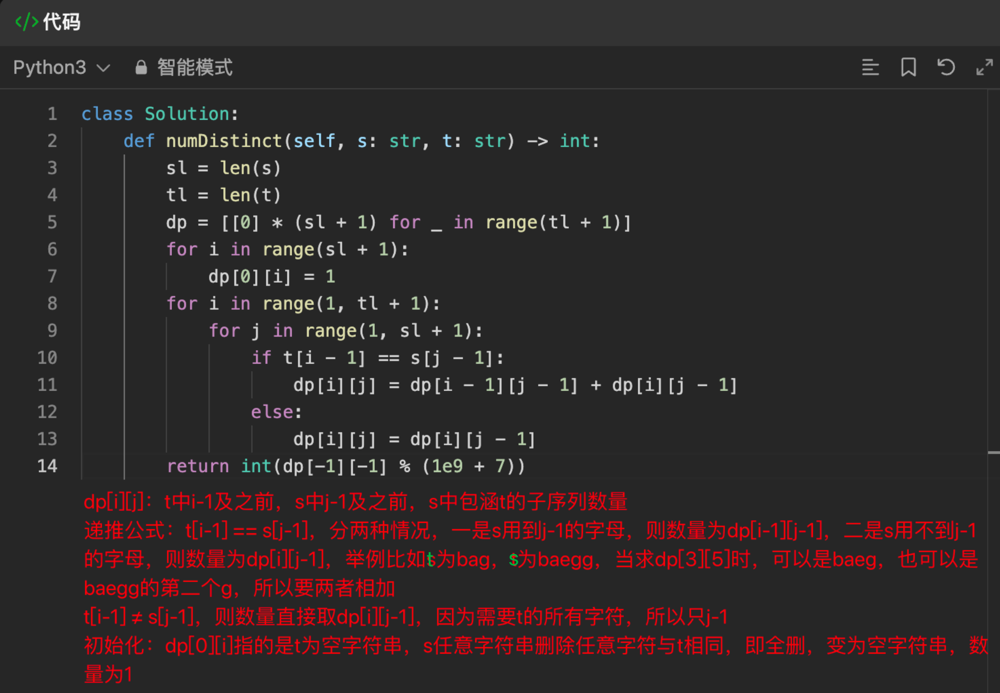

- ##### 583（两个字符串的删除操作）


- ##### 72（编辑距离）


- ##### 647


- ##### 516


### 6.14 丑数


```python
class Solution:
    def nthUglyNumber(self, n: int) -> int:
        a, b, c = 0, 0, 0
        dp = [1] * n
        for i in range(1, n):
            dp[i] = min(dp[a] * 2, dp[b] * 3, dp[c] * 5)
            if dp[a] * 2 == dp[i]: a += 1
            if dp[b] * 3 == dp[i]: b += 1
            if dp[c] * 5 == dp[i]: c += 1
        return dp[-1]
```

# 七、贪心算法

- ##### 455


- ##### 376


所有数一样的数组返回1，这是用例测试出来的

- ##### 53


- ##### 122


- ##### 55


- ##### 45


- ##### 1005


- ##### 134


- ##### 135（双维度切忌同时考虑，顾此失彼）


同时考虑两边会顾此失彼，自己做的时候是同时考虑的，一上午总是会有特列报错，还是要分开考虑

- ##### 860


- ##### 406（双维度切忌同时考虑，顾此失彼）


- ##### 452（区间题）


- ##### 435（思路同上题）

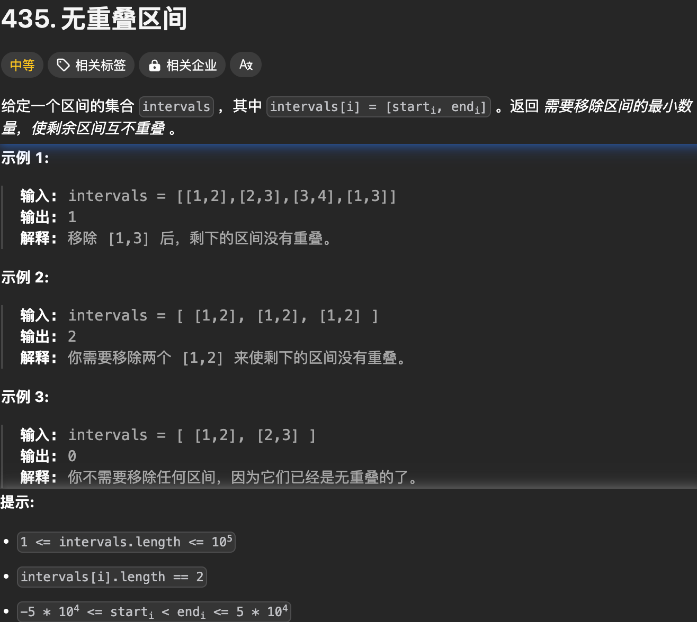


- ##### 763


- ##### 56


- ##### 738


- ##### 968


# 八、回溯

### 8.1 组合（77、17、39、40、216）

- ##### 77


- ##### 216


- ##### 17


最好是字母写个映射列表，代码不用这么长

- ##### 39


- ##### 40


### 8.2 分割（131、93）

- ##### 131


- ##### 93


### 8.3 子集（78、90、491（很类似子集问题））

- ##### 78


- ##### 90


used思路同40题

- ##### 491


### 8.4 排列（46、47）

- ##### 46


- ##### 47


### 8.5 棋盘（51、37）

- ##### 51


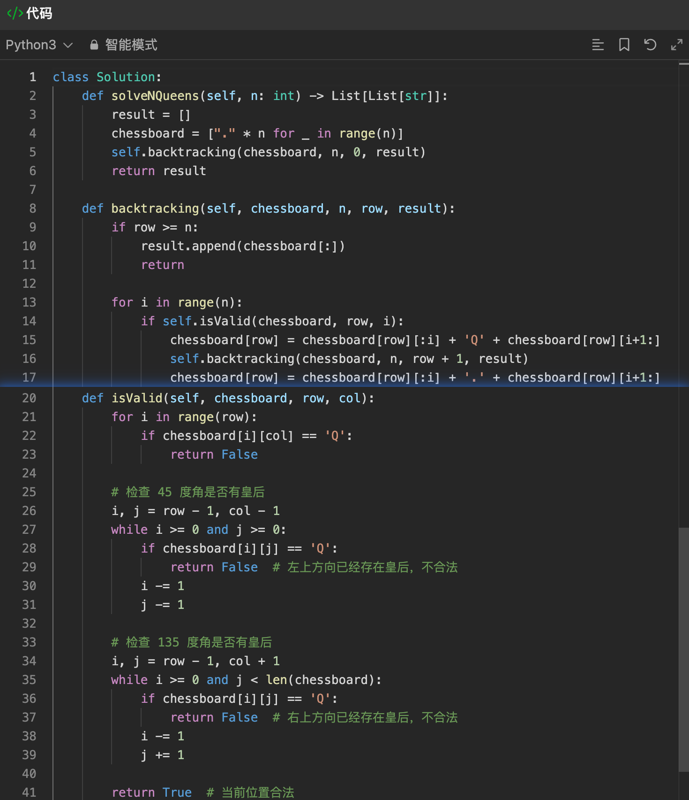

每一行代表一层，只需要判断列、45、135是否违规

- ##### 37


### 8.6 其他（332）

- ##### 332


直接按常理写超时！！


要用字典逆序解决才不会超时


# 九、图论

### 9.1 DFS基础

- ##### 797


- ##### 200


### 9.2 BFS基础

- ##### 200


入队就标记，而不是出队再标记，否则超时

### 9.3 深度广度其他题目

- ##### 695（可dfs/bfs，下面答案为bfs）


- ##### 1020


```python
# 卡玛网ACM
def bfs(matrix, i, j, n, m, visited, direction):
    visited[i][j] = 1
    queue = []
    queue.append((i, j))
    while len(queue) != 0:
        x, y = queue.pop(0)
        for k in range(4):
            new_x, new_y = x + direction[k][0], y + direction[k][1]
            if new_x < 0 or new_x >= n or new_y < 0 or new_y >= m or visited[new_x][new_y] == 1 or matrix[new_x][new_y] == 0:
                continue
            visited[new_x][new_y] = 1
            queue.append((new_x, new_y))

if __name__ == '__main__':
    n, m = map(int, input().split())
    matrix, visited = [], [[0] * m for _ in range(n)]
    direction = [[1, 0], [-1, 0], [0, 1], [0, -1]]
    ans = 0
    for i in range(n):
        matrix.append(list(map(int, input().split())))
    # 上下左右环形先处理掉
    for i in range(n):
        if matrix[i][0] == 1 and visited[i][0] == 0:
            bfs(matrix, i, 0, n, m, visited, direction)
        if matrix[i][m-1] == 1 and visited[i][m-1] == 0:
            bfs(matrix, i, m-1, n, m, visited, direction)
    for j in range(m):
        if matrix[0][j] == 1 and visited[0][j] == 0:
            bfs(matrix, 0, j, n, m, visited, direction)
        if matrix[n-1][j] == 1 and visited[n-1][j] == 0:
            bfs(matrix, n-1, j, n, m, visited, direction)
    # 其他位置为1则是孤岛
    for i in range(n):
        for j in range(m):
            if matrix[i][j] == 1 and visited[i][j] == 0:
                ans += 1
    print(ans)
```

- ##### 130


```python
# 卡玛网ACM
def bfs(matrix, i, j, n, m, visited, direction):
    visited[i][j] = 1
    queue = []
    queue.append((i, j))
    matrix[i][j] = 2
    while len(queue) != 0:
        x, y = queue.pop(0)
        for k in range(4):
            new_x, new_y = x + direction[k][0], y + direction[k][1]
            if new_x < 0 or new_x >= n or new_y < 0 or new_y >= m or visited[new_x][new_y] == 1 or matrix[new_x][new_y] == 0:
                continue
            visited[new_x][new_y] = 1
            matrix[new_x][new_y] = 2
            queue.append((new_x, new_y))

if __name__ == '__main__':
    n, m = map(int, input().split())
    matrix, visited = [], [[0] * m for _ in range(n)]
    direction = [[1, 0], [-1, 0], [0, 1], [0, -1]]
    for i in range(n):
        matrix.append(list(map(int, input().split())))
    # 上下左右环形先处理掉
    for i in range(n):
        if matrix[i][0] == 1 and visited[i][0] == 0:
            bfs(matrix, i, 0, n, m, visited, direction)
        if matrix[i][m-1] == 1 and visited[i][m-1] == 0:
            bfs(matrix, i, m-1, n, m, visited, direction)
    for j in range(m):
        if matrix[0][j] == 1 and visited[0][j] == 0:
            bfs(matrix, 0, j, n, m, visited, direction)
        if matrix[n-1][j] == 1 and visited[n-1][j] == 0:
            bfs(matrix, n-1, j, n, m, visited, direction)
    # 其他位置为1则是孤岛
    for i in range(n):
        for j in range(m):
            if matrix[i][j] == 1:
                matrix[i][j] = 0
            elif matrix[i][j] == 2:
                matrix[i][j] = 1
    for i in range(n):
        print(*matrix[i])
```

- ##### 103（卡码网）


```python
# 反向思考，从边界往上升，两个边界都升到即是答案
def dfs(matrix, i, j, n, m, Edge, direction):
    # 已经漫过
    if Edge[i][j]: return
    Edge[i][j] = True
    for k in range(4):
        new_i, new_j = direction[k][0] + i, direction[k][1] + j
        if new_i < 0 or new_j < 0 or new_i >= n or new_j >= m:
            continue
        # 漫不到新地区
        if matrix[i][j] > matrix[new_i][new_j]:
            continue
        dfs(matrix, new_i, new_j, n, m, Edge, direction)

if __name__ == '__main__':
    n, m = map(int, input().split())
    matrix = []
    direction = [[1, 0], [-1, 0], [0, 1], [0, -1]]
    firstEgde = [[False] * m for _ in range(n)]
    secondEgde = [[False] * m for _ in range(n)]
    for i in range(n):
        matrix.append(list(map(int, input().split())))
    for i in range(n):
        dfs(matrix, i, 0, n, m, firstEgde, direction)
        dfs(matrix, i, m-1, n, m, secondEgde, direction)
    for j in range(m):
        dfs(matrix, 0, j, n, m, firstEgde, direction)
        dfs(matrix, n-1, j, n, m, secondEgde, direction)
    for i in range(n):
        for j in range(m):
            if firstEgde[i][j] and secondEgde[i][j]:
                print(i, j)
```

- ##### 104（卡码网）


```python
# dfs遍历，将每个岛屿的面积记为count，遍历后每个岛屿的位置设置为index（因为有visited，所以遍历过的岛屿不会再遍历），然后将index与count的映射记录下来，之后遍历每个水的位置，然后搜索其4个方向的不同岛屿，面积相加即可
def dfs(matrix, i, j, n, m, visited, direction, index):
    global count
    visited[i][j] = 1
    matrix[i][j] = index
    count += 1
    for k in range(4):
        new_i, new_j = direction[k][0] + i, direction[k][1] + j
        # 越界/已访问/不是陆地, 跳过
        if new_i < 0 or new_j < 0 or new_i >= n or new_j >= m or visited[new_i][new_j] or matrix[new_i][new_j] == 0:
            continue
        dfs(matrix, new_i, new_j, n, m, visited, direction, index)

if __name__ == '__main__':
    n, m = map(int, input().split())
    matrix = []
    direction = [[1, 0], [-1, 0], [0, 1], [0, -1]]
    visited = [[0] * m for _ in range(n)]
    index_to_area = dict()
    ans = 0
    for i in range(n):
        matrix.append(list(map(int, input().split())))
    index = 2
    for i in range(n):
        for j in range(m):
            # 未访问过的陆地
            if matrix[i][j] == 1 and visited[i][j] == 0:
                count = 0
                dfs(matrix, i, j, n, m, visited, direction, index)
                index_to_area[index] = count
                index += 1
    # 全是海
    if index == 2:
        print(1)
    # 全是陆地
    elif index == 3 and index_to_area[2] == n * m:
        print(n*m)
    else:
        for i in range(n):
            for j in range(m):
                if matrix[i][j] == 0:
                    already = [0]
                    area = 1
                    for k in range(4):
                        new_i, new_j = direction[k][0] + i, direction[k][1] + j
                        # 越界/不是陆地/已计算过此岛屿, 跳过
                        if new_i < 0 or new_j < 0 or new_i >= n or new_j >= m or matrix[new_i][new_j] in already:
                            continue
                        already.append(matrix[new_i][new_j])
                        area += index_to_area[matrix[new_i][new_j]]
                    ans = max(ans, area)
        print(ans)
```

- ##### 110（卡码网）


```python
# 最短路径，适合bfs，如何解决字符串间的连接关系问题，自己想的是用字典，但空间时间复杂度均比较大（虽然代码比较简洁），这个答案用的是遍历位置加字母
def main():
    N = int(input())
    beginStr, endStr = map(str, input().split())
    visited = set()
    strSet = set()
    for i in range(N):
        strSet.add(input())
    queue, ans = [beginStr], 1
    while len(queue) != 0:
        length = len(queue)
        while length > 0:
            nowStr = queue.pop(0)
            visited.add(nowStr)
            for i in range(len(nowStr)):
                for j in range(26):
                    changeStr = nowStr[:i] + chr(ord('a') + j) + nowStr[i+1:]
                    if changeStr == endStr:
                        print(ans + 1)
                        return
                    if changeStr in strSet and changeStr not in visited:
                        visited.add(changeStr)
                        queue.append(changeStr)
            length -= 1
        ans += 1

if __name__ == "__main__":
    main()
```

- ##### 105（卡码网）


```python
# visited访问过的数量等于N则全部可达，使用邻接表存储
from collections import defaultdict

def dfs(adjacency, start):
    global visited
    visited.append(start)
    for each in adjacency[start]:
        if each in visited: continue
        dfs(adjacency, each)

if __name__ == "__main__":
    N, K = map(int, input().split())
    adjacency = defaultdict(list)
    for i in range(K):
        start, end = map(int, input().split())
        adjacency[start].append(end)
    visited = []
    dfs(adjacency, 1)
    if len(visited) == N: print(1)
    else: print(-1)
```

- ##### 106（卡码网）


```python
# bfs，超范围/遇0则边长+1
def bfs(matrix, i, j, N, M, visited, direction):
    perimeter = 0
    queue = [(i, j)]
    visited[i][j] = 1
    while len(queue) != 0:
        length = len(queue)
        while length > 0:
            x, y = queue.pop(0)
            for k in range(4):
                new_x, new_y = direction[k][0] + x, direction[k][1] + y
                if new_x < 0 or new_y < 0 or new_x >= N or new_y >= M or matrix[new_x][new_y] == 0:
                    perimeter += 1
                    continue
                if visited[new_x][new_y]:
                    continue
                queue.append((new_x, new_y))
                visited[new_x][new_y] = 1
            length -= 1
    return perimeter


def main():
    N, M = map(int, input().split())
    matrix, visited = [], [[0] * M for _ in range(N)]
    direction = [[1, 0], [-1, 0], [0, 1], [0, -1]]
    for i in range(N):
        matrix.append(list(map(int, input().split())))
    for i in range(N):
        for j in range(M):
            if matrix[i][j] == 1:
                print(bfs(matrix, i, j, N, M, visited, direction))
                return

if __name__ == '__main__':
    main()
```

### 9.4 并查集

并查集常用来解决连通性问题。大白话就是当我们需要判断两个元素是否在同一个集合里的时候，我们就要想到用并查集。

并查集主要有两个功能：

- 将两个元素添加到一个集合中。
- 判断两个元素在不在同一个集合

空间复杂度： O(n) ，申请一个father数组。

时间复杂度：在O(logn)与O(1)之间，且随着查询或者合并操作的增加，时间复杂度会越来越趋于O(1)。在第一次查询的时候，相当于是n叉树上从叶子节点到根节点的查询过程，时间复杂度是logn（lognN，n叉树，N个结点，树高lognN），但路径压缩后，后面的查询操作都是O(1)，而 join 函数 和 isSame函数 里涉及的查询操作也是一样的过程。

```c++
/*
C++并查集模板
*/

int n = 1005; // n根据题目中节点数量而定，一般比节点数量大一点就好
vector<int> father = vector<int> (n, 0); // C++里的一种数组结构

// 并查集初始化
void init() {
    for (int i = 0; i < n; ++i) {
        father[i] = i;
    }
}
// 并查集里寻根的过程
int find(int u) {
    return u == father[u] ? u : father[u] = find(father[u]); // 路径压缩
}

// 判断 u 和 v是否找到同一个根
bool isSame(int u, int v) {
    u = find(u);
    v = find(v);
    return u == v;
}

// 将v->u 这条边加入并查集
void join(int u, int v) {
    u = find(u); // 寻找u的根
    v = find(v); // 寻找v的根
    if (u == v) return ; // 如果发现根相同，则说明在一个集合，不用两个节点相连直接返回
    father[v] = u;
}
```

```python
"""
python并查集模板
"""

# n根据题目中节点数量而定，一般比节点数量大一点就好
n = 1005 
father = dict()

# 并查集初始化
def init():
    for i in range(n):
        father[i] = i

# 并查集里寻根的过程
def find(u):
    # 路径压缩
    if u != father[u]:
        father[u] = find(father[u])
    return father[u]

# 判断 u 和 v是否找到同一个根
def isSame(u, v) {
    u = find(u)
    v = find(v)
    return u == v
}

# 将v->u 这条边加入并查集
def join(u, v) {
    u = find(u) # 寻找u的根
    v = find(v) # 寻找v的根
    if u == v return # 如果发现根相同，则说明在一个集合，不用两个节点相连直接返回
    father[v] = u
}
```

- ##### 107（卡码网）


```python
def init(N):
    father = dict()
    for i in range(N+1):
        father[i] = i
    return father

def find(u):
    global father
    if u != father[u]:
        father[u] = find(father[u])
    return father[u]

def isSame(u, v):
    u = find(u)
    v = find(v)
    return u == v

def join(u, v):
    global father
    u = find(u)
    v = find(v)
    if u == v: return
    father[v] = u

if __name__ == '__main__':
    N, M = map(int, input().split())
    father = init(N)
    for i in range(M):
        s, t = map(int, input().split())
        join(s, t)
    print(int(isSame(*map(int, input().split()))))
```

- ##### 108（卡码网）


```python
# 第一次isSame即说明边冗余，而N点N边只可能有一个圈，第一次出现Same就是最后一个可删除的
def init(N):
    father = dict()
    for i in range(N+1):
        father[i] = i
    return father

def find(u):
    global father
    if u != father[u]:
        father[u] = find(father[u])
    return father[u]

def isSame(u, v):
    u = find(u)
    v = find(v)
    return u == v

def join(u, v):
    global father
    u = find(u)
    v = find(v)
    if u == v: return
    father[v] = u

if __name__ == '__main__':
    N = int(input())
    father = init(N)
    for i in range(N):
        s, t = map(int, input().split())
        if isSame(s, t): ans = [s, t]
        else: join(s, t)
    print(*ans)
```

- ##### 109（卡码网）


```python
"""
N点N边，最多一个点有2点入度（3点的话就需要删两条边了）
情况1：一个2点入度的点，删除最后出现且成环的一条（这两条都成环）
情况2：一个2点入度的点，删除成环的一条（只有一条成环）
情况3：全是1点入度的点，删除最后出现且成环的一条
"""

from collections import defaultdict

def init(N):
    father = dict()
    for i in range(N+1):
        father[i] = i
    return father

def find(u):
    global father
    if u != father[u]:
        father[u] = find(father[u])
    return father[u]

def isSame(u, v):
    u = find(u)
    v = find(v)
    return u == v

def join(u, v):
    global father
    u = find(u)
    v = find(v)
    if u == v: return
    father[v] = u

def delEdgeIsTree(edges, del_edge, N):
    for i in range(N):
        if isSame(*edges[i]) and edges[i] == del_edge:
            return True
        join(*edges[i])
    return False

def removeCircle(edges, N):
    for i in range(N):
        if isSame(*edges[i]):
            return edges[i]
        join(*edges[i])

if __name__ == '__main__':
    N = int(input())
    edges = []
    inDegree = defaultdict(int)
    for i in range(N):
        s, t = map(int, input().split())
        edges.append([s, t])
        inDegree[t] += 1
    father = init(N)
    wait_to_del_edge = []
    # 倒叙遍历，如果后边的成环就删除，如果后边的不成环就删除前一条
    for i in range(N-1, -1, -1):
        if inDegree[edges[i][1]] == 2:
            wait_to_del_edge.append(edges[i])
    if wait_to_del_edge:
        if delEdgeIsTree(edges, wait_to_del_edge[0], N):
            print(*wait_to_del_edge[0])
        else:
            print(*wait_to_del_edge[1])
    # 如果都是入度为1的，删除成环的一条即可
    else:
        print(*removeCircle(edges, N))
```

### 9.5 最小生成树

**prim算法（维护节点，可负权值）**核心就是三步，即prim三部曲：

1. 第一步，选距离生成树最近节点
2. 第二步，最近节点加入生成树
3. 第三步，更新非生成树节点到**生成树**的距离（即更新minDist数组），注意与dijkstra中minDist区别

—> 番外，记录最小生成树路径，parent，注意 `parent[j] = cur`

—> 时间复杂度O(n^2)，n结点个数

- ##### 53（卡码网）


```python
if __name__ == '__main__':
    V, E = map(int, input().split())
    matrix = [[10001] * (V+1) for _ in range(V+1)]
    for i in range(E):
        v1, v2, val = map(int, input().split())
        matrix[v1][v2] = val
        matrix[v2][v1] = val
    minDist = [10001] * (V+1)
    parent = [-1] * (V+1)
    isInTree = [False] * (V+1)
    # 只需要循环 n-1次，建立n-1条边，就可以把n个节点的图连在一起
    for i in range(1, V):
        # 三部曲，第一步，选距离生成树最近节点
        cur = -1
        minVal = float('inf')
        for j in range(1, V+1):
            """
            选取最小生成树节点的条件：
            （1）不在最小生成树里
            （2）距离最小生成树最近的节点
            """
            if not isInTree[j] and minDist[j] < minVal:
                minVal = minDist[j]
                cur = j
        # 三部曲，第二步，最近节点(cur)加入生成树
        isInTree[cur] = True
        # 三部曲，第三步，更新非生成树节点到生成树的距离(即更新minDist数组)
        for j in range(1, V+1):
            if not isInTree[j] and matrix[cur][j] < minDist[j]:
                minDist[j] = matrix[cur][j]
                parent[j] = cur
    ans = 0
    # 求和只需V-1条边即可
    for i in range(2, V+1):
        ans += minDist[i]
    print(ans)
```

**Kruskal算法（维护边）**：对边的权值进行排序，每次往最小生成树中加入权值最小的边，但加入的边两点不得在此边加入之前就同在树中（并查集判断）

—> 时间复杂度O(elog(e) + log(e)) = O(eloge)，e边个数

```python
def init(N):
    father = dict()
    for i in range(N+1):
        father[i] = i
    return father

def find(u):
    global father
    if u != father[u]:
        father[u] = find(father[u])
    return father[u]

def isSame(u, v):
    u = find(u)
    v = find(v)
    return u == v

def join(u, v):
    global father
    u = find(u)
    v = find(v)
    if u == v: return
    father[v] = u

if __name__ == '__main__':
    V, E = map(int, input().split())
    father = init(V)
    edges = []
    for i in range(E):
        v1, v2, val = map(int, input().split())
        edges.append([v1, v2, val])
    # 按照权值从小到大排序
    edges.sort(key=lambda x: x[2])
    # 从小到大加入最小生成树
    ans = 0
    for v1, v2, val in edges:
        if isSame(v1, v2):
            continue
        join(v1, v2)
        ans += val
    print(ans)
```

### 9.6 拓扑排序

**拓扑排序**：给出一个有向图（结点间的先后关系），把这个有向图转成线性的排序，就叫拓扑排序

1. 维护一个结点入度表（每个结点的入度）、出度表（每个结点指向的结点列表），并初始化队列，入度为0的结点入队列
2. 当队列长度不为0时，出队列，按照出度表将该结点指向的所有结点的入度减1，如果减到0，入队
3. 循环，直至所有结点已出队（过程中如果队列已空但非所有结点已出队列，说明存在有向环，无解）

- ##### 117（卡码网）


```python
from collections import defaultdict

if __name__ == '__main__':
    N, M = map(int, input().split())
    inDegree = [0] * N
    toOther = defaultdict(list)
    for i in range(M):
        S, T = map(int, input().split())
        inDegree[T] += 1
        toOther[S].append(T)
        
    queue = []
    for i in range(len(inDegree)):
        if inDegree[i] == 0:
            queue.append(i)
    
    ans = []
    while len(queue) != 0:
        point = queue.pop(0)
        ans.append(point)
        for peer in toOther[point]:
            inDegree[peer] -= 1
            if inDegree[peer] == 0:
                queue.append(peer)
    
    if len(ans) != N: print(-1)
    else: print(*ans)
```

### 9.7 最短路径

**dijkstra算法（权值非负数）**：在有权图中求从起点到其他节点的最短路径算法。三部曲

1. 第一步，选源点到哪个节点近且该节点未被访问过
2. 第二步，该最近节点被标记访问过
3. 第三步，更新非访问节点到**源点**的距离（即更新minDist数组），注意与prim中minDist区别

—> 番外，记录最小生成树路径，parent，注意 `parent[j] = cur`

—> 时间复杂度O(n^2)，n结点个数


```python
if __name__ == '__main__':
    N, M = map(int, input().split())
    matrix = [[float('inf')] * (N+1) for _ in range(N+1)]
    for i in range(M):
        S, E, V = map(int, input().split())
        matrix[S][E] = V
    start, end = 1, N
    minDist, visited = [float('inf')] * (N+1), [False] * (N+1)
    parent = [-1] * (N+1)
    minDist[start] = 0
    for i in range(N):
        # 三部曲之一部曲，选源点到哪个节点近且该节点未被访问过
        minVal = float('inf')
        cur = 1
        for v in range(1, N+1):
            if not visited[v] and minDist[v] < minVal:
                minVal = minDist[v]
                cur = v
        # 三部曲之二部曲，该最近节点被标记访问过
        visited[cur] = True
        # 三部曲之三部曲，更新非访问节点到源点的距离(即更新minDist数组)
        for v in range(1, N+1):
            if not visited[v] and matrix[cur][v] != float('inf') and matrix[cur][v] + minDist[cur] < minDist[v]:
                minDist[v] = minDist[cur] + matrix[cur][v]
                parent[v] = cur
        
        """
        debug: 打印minDist即可
        """
        print(*minDist)
        
    if minDist[end] == float('inf'): print(-1)
    else: print(minDist[-1])
```

**dijkstra堆排序优化算法**：按照边去遍历，存储也是按边，**注意小顶堆排序按照的是minDist而不是edge[1]**

—> 时间复杂度O(eloge)，空间复杂度O(n+e)，n结点个数，e边个数

```python
from collections import defaultdict
import heapq
 
if __name__ == '__main__':
    N, M = map(int, input().split())
    edges = defaultdict(list)
    for i in range(M):
        S, E, V = map(int, input().split())
        edges[S].append([E, V])
    start, end = 1, N
    minDist, visited = [float('inf')] * (N+1), [False] * (N+1)
    minDist[start] = 0
    queue = []
    # 默认小顶堆, 按第一个元素
    heapq.heappush(queue, [0, start])
    while len(queue) != 0:
        minDist_cur, cur = heapq.heappop(queue)
        # 可能会有结点多次入队(每条边必会入队一次)，所以这里判断一下
        if visited[cur]: continue
        visited[cur] = True
        for edge in edges[cur]:
            if not visited[edge[0]] and minDist_cur + edge[1] <  minDist[edge[0]]:
                minDist[edge[0]] = minDist_cur + edge[1]
                heapq.heappush(queue, [minDist[edge[0]], edge[0]])
         
    if minDist[end] == float('inf'): print(-1)
    else: print(minDist[-1])
```

**Bellman_ford算法**：的核心思想是对所有边进行松弛n-1次操作（n为节点数量），从而求得目标最短路


minDist[B] 表示 到达B节点 最小权值，minDist[B] 有哪些状态可以推出来？

状态一： minDist[A] + value 可以推出 minDist[B] 状态二： minDist[B]本身就有权值 （可能是其他边链接的节点B 例如节点C，以至于 minDist[B]记录了其他边到minDist[B]的权值）

```python
# 松弛
if minDist[B] > minDist[A] + value: minDist[B] = minDist[A] + value
```

节点数量为n，那么起点到终点，最多是 n-1 条边相连。那么无论图是什么样的，边是什么样的顺序，我们对所有边松弛 **n-1**次就一定能得到起点到达终点的最短距离。

—> 时间复杂度O(n * e)，空间复杂度O(n)，n结点个数，e边个数


```python
if __name__ == '__main__':
    N, M = map(int, input().split())
    edges = []
    for _ in range(M):
        S, E, V = map(int, input().split())
        edges.append([S, E, V])
    start, end = 1, N
    minDist = [float('inf')] * (N+1)
    minDist[start] = 0
    # 松弛N-1次
    for _ in range(N-1):
        update = False
        for edge in edges:
            S, E, V = edge
            if minDist[S] == float('inf'):
                continue
            elif minDist[S] + V < minDist[E]:
                minDist[E] = minDist[S] + V
                update = True
        # 不更新时说明已最优
        if not update: break
        """
        debug: 打印minDist即可
        """
        # print(*minDist)
        
    if minDist[end] == float('inf'): print('unconnected')
    else: print(minDist[end])
```

**SPFA算法**：Bellman_ford的队列优化算法，松弛时，是基于已经计算过的节点在做的松弛

```python
from collections import defaultdict
 
if __name__ == '__main__':
    N, M = map(int, input().split())
    edges = defaultdict(list)
    for _ in range(M):
        S, E, V = map(int, input().split())
        edges[S].append([E, V])
    start, end = 1, N
    minDist = [float('inf')] * (N+1)
    minDist[start] = 0
    queue = [start]
    while len(queue) != 0:
        S= queue.pop(0)
        for edge in edges[S]:
            E, V = edge
            if minDist[S] + V < minDist[E]:
                minDist[E] = minDist[S] + V
                queue.append(E)
        # 不更新时说明已最优
        """
        debug: 打印minDist即可
        """
        # print(*minDist)
         
    if minDist[end] == float('inf'): print('unconnected')
    else: print(minDist[end])
```

**Bellman_ford之判断负权回路**：

- Bellman_ford：至少松弛n-1次就可最优，如果存在负权回路，则第n次时，如果还有松弛的空间，则存在负权回路
- SPFA：考虑最极端的情况，所有结点均与其他结点相连，出度为n-1，则每个结点最多入队n-1次（遍历n-1条边），如果一个结点入队n次以上，则存在负权回路


```python
if __name__ == '__main__':
    N, M = map(int, input().split())
    edges = []
    for _ in range(M):
        S, E, V = map(int, input().split())
        edges.append([S, E, V])
    start, end = 1, N
    minDist = [float('inf')] * (N+1)
    minDist[start] = 0
    flag = False
    # 松弛N次
    for i in range(1, N+1):
        update = False
        for edge in edges:
            S, E, V = edge
            if minDist[S] == float('inf'):
                continue
            elif i < N and minDist[S] + V < minDist[E]:
                minDist[E] = minDist[S] + V
                update = True
            elif i == N and minDist[S] + V < minDist[E]:
                flag = True
                break
        # 不更新时说明已最优
        if not update: break
        """
        debug: 打印minDist即可
        """
        # print(*minDist)
        
    if flag: print('circle')
    elif minDist[end] == float('inf'): print('unconnected')
    else: print(minDist[end])
```

**Bellman_ford之单源有限最短路**：最多经过k个结点，对应到算法，可以等同于最多经过k+1条边（k+1次松弛），可以求得起点到距起点k+1条边的最短距离。如果只改遍历次数，会报错，原因是如果存在负权回路，minDist是越来越错的（虽然可以用n-1次和n次的minDist是否还会更新判断是否存在负权回路，但是也只是关心minDist是否会变化，实际上minDist数值是错误的），因为存在负权回路时，更新minDist会用到本轮刚更新的minDist，而不是上次遍历的minDist，就可能会导致本该第2次遍历才该变化的边在第1次遍历就发生变化（在不存在负权回路的途中也可能根据本轮的minDist更新minDist，但这样仅提前更新minDist，遍历次数n-1后minDist肯定就不会在变化，根不根据本轮的minDist去更新minDist也就无所谓了，关心的只是最后的结果），所以就会出问题，做法是保存上次遍历的minDist，用上次遍历的minDist更新本轮遍历即可

- Bellman_ford：松弛k+1次，并用上轮minDist更新这轮
- SPFA：每次都保存队列中结点数量，全完算一次，再保存下次出队的结点数，总共k次


```python
if __name__ == '__main__':
    N, M = map(int, input().split())
    edges = []
    for _ in range(M):
        S, E, V = map(int, input().split())
        edges.append([S, E, V])
    start, end, k = map(int, input().split())
    minDist = [float('inf')] * (N+1)
    minDist[start] = 0
    flag = False
    # 松弛k+1次
    for i in range(k+1):
        minDist_copy = minDist.copy()
        for edge in edges:
            S, E, V = edge
            if minDist_copy[S] != float('inf') and minDist_copy[S] + V < minDist[E]:
                minDist[E] = minDist_copy[S] + V
        """
        debug: 打印minDist即可
        """
        # print(*minDist)
        
    if minDist[end] == float('inf'): print('unreachable')
    else: print(minDist[end])
```

**Floyd算法**：多源最短路径，权值正负都可，核心思想动态规划，grid [i] [j] [k] = m，表示 节点i 到 节点j 以[1...k] 集合为中间节点的最短距离为m（经过 [1-k] 不意味着 1-k 每个结点都经过，而是考虑了 1-k 这 k 个结点）

- 递推公式：`grid[i][j][k] = min(grid[i][k][k - 1] + grid[k][j][k - 1]， grid[i][j][k - 1])`，即 i 到 j。经过 [1-k] 是经过 k 和不经过 k 的最小值
- 初始化：初始输入的边都是`k = 0`，其他位置初始化为`float('inf')`
- 遍历顺序：k 依赖于 k-1，所以 k 一定是顺序，i、j没有依赖 i-1、j-1 所以遍历顺序都可，也按照顺序，**三者之间必须 k 在最外层**，可以看下图，必须一层一层的向上更新，如果 i/j 最外层，则会变成从前后左右一片一片的更新，是不对的
- 空间优化：只需要定义 [n+1, n+1, 2] 大小的数组，因为 k 层只依赖 k-1，不需要记录 k-2、k-3等信息


```python
if __name__ == '__main__':
    N, M = map(int, input().split())
    grid = [[[float('inf'), float('inf')] for _ in range(N+1)] for _ in range(N+1)]
    for _ in range(M):
        S, E, V = map(int, input().split())
        grid[S][E][0], grid[E][S][0] = V, V
    for k in range(1, N+1):
        for i in range(1, N+1):
            for j in range(1, N+1):
                grid[i][j][1] = min(grid[i][j][0], grid[i][k][0] + grid[k][j][0])
        for i in range(1, N+1):
            for j in range(1, N+1):
                grid[i][j][0] = grid[i][j][1]
    plan_ans = []
    Q = int(input())
    for _ in range(Q):
        S, E = map(int, input().split())
        if grid[S][E][0] == float('inf'):
            plan_ans.append(-1)
        else: plan_ans.append(grid[i][j][0])
    for i in range(Q):
        print(plan_ans[i])
```

