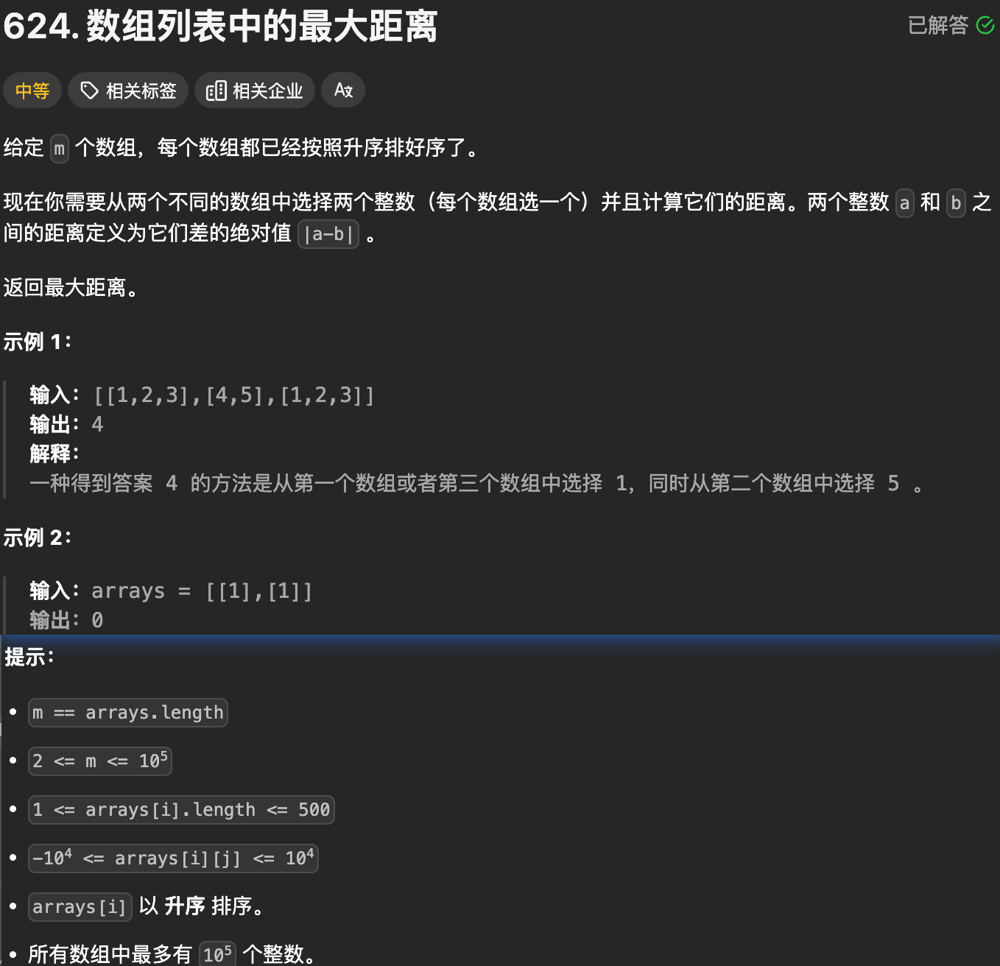

# 尊享面试

### 1. [数组列表中的最大距离](https://leetcode.cn/problems/maximum-distance-in-arrays/)（624）



```python
class Solution:
    def maxDistance(self, arrays: List[List[int]]) -> int:
        minimum, maximum = min(arrays[0]), max(arrays[0])
        ans = 0
        for i in range(1, len(arrays)):
            # 内部已升序, 直接取数即可, 降低时间复杂度
            min_i, max_i = arrays[i][0], arrays[i][-1]
            # ans = max(ans, abs(maximum - min_i), abs(minimum - max_i))
            # 不加abs也可以
            ans = max(ans, maximum - min_i, max_i - minimum)
            minimum = min(minimum, min_i)
            maximum = max(maximum, max_i)
        return ans
```

### 2. [摆动序列](https://leetcode.cn/problems/wiggle-sort/description/?envType=study-plan-v2&envId=premium-algo-100)（280）


```python
class Solution:
    def wiggleSort(self, nums: List[int]) -> None:
        """
        Do not return anything, modify nums in-place instead.
        """
        # 排序解法
        # nums.sort()
        # n = len(nums)
        # for i in range(2, n, 2):
        #     nums[i], nums[i-1] = nums[i-1], nums[i]
        
        # 贪心, 两两比较, 奇数i偶数i分别判断即可, 交换后一定还是满足, 不需要排序
        n = len(nums)
        for i in range(1, n):
            if (i % 2 == 1 and nums[i] < nums[i-1]) or (i % 2 == 0 and nums[i] > nums[i-1]):
                nums[i], nums[i-1] = nums[i-1], nums[i]
```

### 3. [易混淆数](https://leetcode.cn/problems/confusing-number/description/?envType=study-plan-v2&envId=premium-algo-100)（1056）


```python
class Solution:
    def confusingNumber(self, n: int) -> bool:
        not_confuse = ['2', '3', '4', '5', '7']
        confuse_sure = ['0', '1', '8']
        flag = False
        n_str = str(n)
        length = len(n_str)
        if length == 1:
            if n_str in ['6', '9']: return True
            return False
        for i in range(length):
            if n_str[i] in not_confuse: return False
            if n_str[i] in confuse_sure and n_str[i] == n_str[length-i-1]: continue
            if n_str[i] == '6' and n_str[length-i-1] == '9': continue
            if n_str[i] == '9' and n_str[length-i-1] == '6': continue
            flag = True
        return flag
```

